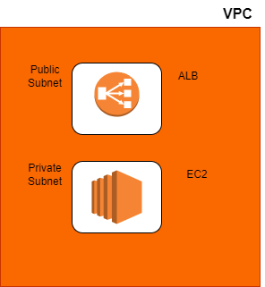

## Introduction

The content on this folder deploys resources in AWS using Terrform. 

The following resources are created: 

* S3 bucket - For remote state
* Dynamo DB table - For state locking
* VPC - with CIDR range 10.50.0.0/16
* EC2 instance - in private subnet with a security group
* ALB - Public facing application load balancer with target group and listener

